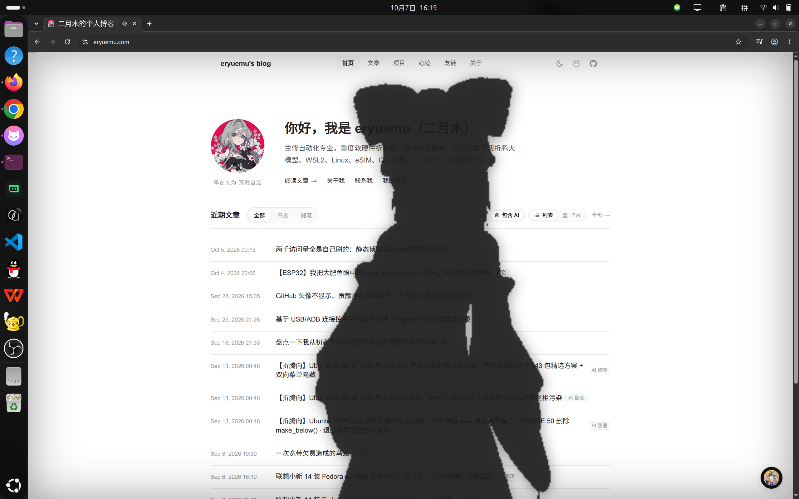
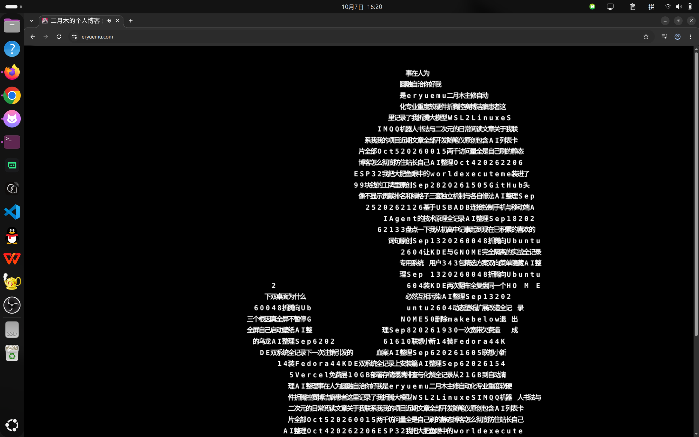

# bad-apple-easter-egg

一个轻量、零依赖的网页端 Bad Apple!! 彩蛋库。支持从当前页面动态提取活体文字并沿流场汇聚成开场人物剪影，无缝衔接 60 FPS 汉字流点阵播放，以及保留网页底色的全息透明剪影播放。

本项目最初诞生于个人博客 [eryuemu.com](https://eryuemu.com)（对应开源仓库 [eryuemu/eryuemu-blog](https://github.com/eryuemu/eryuemu-blog)），为了方便在其他静态博客（Hexo, Hugo, VitePress, Astro）或任意前端页面中直接复用，将其解耦并抽象为独立的前端库。

---

## 项目渊源与博客 Commit

该彩蛋的核心算法与交互逻辑源于在个人博客上的探索与调优，相关演进可追溯至 `eryuemu-blog` 仓库的以下提交：

- [`5d318d1`](https://github.com/eryuemu/eryuemu-blog/commit/5d318d17be4f62578cef3b4a6f4aff6527e512c9) - `feat(easter-egg): 新增 Bad Apple 双模式原生彩蛋（全息剪影与博文文字粒子流）`
  - 初版实现：完成 32 位全息抠像通道与字符粒子从 DOM 坐标汇聚至 88×35 灵梦点阵的雏形。
- [`0ab006e`](https://github.com/eryuemu/eryuemu-blog/commit/0ab006ed74cb5499afd17b2f44213b2aeb87a709) - `feat(easter-egg): 优化 Bad Apple 音画锁相与丝滑过渡，引入本地无延迟媒体源`
  - 性能与过渡重构：重构为四阶减速曲线（Quartic Ease-Out）、400ms 离屏 GPU 纹理预热消除卡顿、1:1 字符序号锁定（消除接棒跳变）、前奏第 4 拍鼓点同帧贯穿与扩散冲击波。
- [`8d59d75`](https://github.com/eryuemu/eryuemu-blog/commit/8d59d7516db59d4b7ccabba1558802affc2fb0f4) - `feat(easter-egg): 优化字符物理流变，引入前置 360ms 原地引力中心吸附拉扯动效`
  - 物理流变升级：新增前置 360ms 原地引力吸积阶段（文字粒子沿视口中心加速拉扯偏移 42%），营造博文文字被引力场骤然撕裂吸入的震撼破界感，而后无缝衔接旋涡汇聚与开场灵梦剪影。

> 如果在具体项目中无法复现或遇到细节问题，可以让 AI 研究一下我的博客（[eryuemu/eryuemu-blog](https://github.com/eryuemu/eryuemu-blog)）是如何实现的。

---

## 核心模式与效果预览

### 1. 全息透明剪影模式 (`silhouette`)
保留网页原本的排版、背景与暗色主题，通过 32 位底层像素通道实时抠像与自适应阈值，高对比剪影直接在网页上方奔跑跃动：



### 2. 文字流变矩阵模式 (`matrix`)
提取视口内真实 DOM 文字（标题、正文、代码等），粒子先经 360ms 原地强力吸入，再沿贝塞尔三维流场向中央汇聚并拼合为博丽灵梦剪影；前奏第 4 拍（1.35s）同帧接棒，全屏渲染 60 FPS 汉字点阵视频：



---

## 播放要求与兼容性注意事项

为了保证在不同设备和网络环境下都能正常播放，请务必注意以下几点：

### 1. 浏览器自动播放限制 (Autoplay Policy)
现代浏览器（Chrome, Safari, Edge, Firefox 等）禁止在没有**用户手势交互**的情况下自动播放带声音的媒体。
- 本库采用 **5 次快速连击** 机制（如连击头像或昼夜按钮），该交互满足浏览器的 User Gesture 条件，起播时音量正常。
- 若要在代码中直接调用 `startBadApple()`，必须确保调用发生于用户的某个点击/按键事件回调中；如果在页面加载时直接调用，会被浏览器拦截（`NotAllowedError`），此时需设置 `volume: 0` 静音播放。

### 2. Canvas 跨域策略 (CORS & Tainted Canvas)
汉字流与抠像算法需要使用 `ctx.getImageData()` 逐帧读取视频像素。
- 如果视频托管在外部 CDN 或不同域名的服务器上，**远程服务器的 HTTP 响应头必须返回 `Access-Control-Allow-Origin: *`**，否则浏览器会抛出安全错误（`SecurityError: The canvas has been tainted by cross-origin data`）并中断渲染。
- **推荐做法**：将视频文件放在网站自身的本地静态资源目录中（如 `/public/media/bad-apple.mp4` 或博客的静态资源目录），同源访问可以彻底避免跨域与防盗链问题。

### 3. 视频编码要求
如果自行准备或转码视频，必须严格遵循以下参数：
- **封装格式**：MP4
- **视频编码**：H.264 / AVC（High Profile，`yuv420p` 像素格式）
- **音频编码**：AAC（立体声）
- **分辨率建议**：480×360 或 640×480（兼顾体积与取帧性能）
- **避免使用**：WebM (VP8/VP9/AV1) 或 H.264 `yuv444p`，否则在 iOS Safari、移动端微信/QQ 内置浏览器中容易出现黑屏或解码失败。

推荐的 FFmpeg 转码命令：
```bash
ffmpeg -i input.mp4 -c:v libx264 -profile:v high -pix_fmt yuv420p -c:a aac -b:a 128k -movflags +faststart bad-apple.mp4
```

---

## 安装与使用

### 1. 传统 HTML / CDN（直接使用 `<script>` 标签）
库内已内置样式自动注入逻辑，无需手动引入 CSS：

```html
<script src="https://cdn.jsdelivr.net/npm/bad-apple-easter-egg/dist/bad-apple-easter-egg.iife.js"></script>
<script>
  BadAppleEasterEgg.init({
    videoUrl: '/media/bad-apple.mp4',
    clicks: 5,
  });
</script>
```

默认会自动监听：
- `#theme-toggle` / `.theme-toggle` 连击 5 次 ➔ 触发文字流变矩阵模式
- `.avatar` / `.hero-avatar` 连击 5 次 ➔ 触发全息透明剪影模式

### 2. npm 工程（Vue, React, Astro, VitePress, Next.js 等）

```bash
npm install bad-apple-easter-egg
```

```typescript
import { initBadApple, startBadApple, stopBadApple } from 'bad-apple-easter-egg';
// 样式会自动注入，也可按需显式导入：
import 'bad-apple-easter-egg/style.css';

// 初始化彩蛋监听器
initBadApple({
  videoUrl: '/media/bad-apple.mp4',
  clicks: 5,
  mode: 'matrix',
  volume: 0.8,
});

// 手动调用 API
// startBadApple('matrix');
// startBadApple('silhouette');
// stopBadApple();
```

---

## 配置参数 (Options)

| 参数 | 类型 | 默认值 | 说明 |
| :--- | :--- | :--- | :--- |
| `trigger` | `string \| HTMLElement` | `undefined` | 自定义触发元素选择器或 DOM 节点。未指定时默认代理昼夜切换与头像 |
| `clicks` | `number` | `5` | 连续点击次数阈值 |
| `clickTimeout` | `number` | `2200` | 判定连击的超时时间（毫秒） |
| `mode` | `'matrix' \| 'silhouette'` | `'matrix'` | 默认播放模式 |
| `videoUrl` | `string` | 本地/CDN 兜底 | 视频源地址（推荐同源本地路径） |
| `fallbackVideoUrl` | `string` | jsDelivr CDN | 主视频加载失败时的备用源 |
| `volume` | `number` | `0.8` | 音量（0.0 ~ 1.0） |
| `showToast` | `boolean` | `true` | 是否显示连击充能反馈提示 |
| `textSelector` | `string` | 常见正文元素 | 提取文字的 DOM 选择器 |
| `keyboardControls` | `boolean` | `true` | 是否启用键盘控制（ESC 退出，空格暂停/播放） |
| `clickToExit` | `boolean` | `true` | 点击屏幕任意位置是否退出 |
| `onStart` | `(mode) => void` | `undefined` | 启动回调 |
| `onEnd` | `() => void` | `undefined` | 退出复原回调 |
| `onPlayError` | `(error) => void` | `undefined` | 播放异常或被浏览器策略拦截时的回调 |

---

## 本地开发与体验 Demo

仓库内置了可直接运行的交互式 Demo 页面（基于本地裁剪好的 5.7MB 测试视频）：

```bash
git clone https://github.com/eryuemu/bad-apple-easter-egg.git
cd bad-apple-easter-egg

npm install
npm run dev
```

启动后在浏览器打开开发服务器地址（默认 `http://localhost:5173`），即可在模拟博客页面中测试连击彩蛋及控制面板。

打包构建：
```bash
npm run build
```

---

## 开发致谢

本项目全量代码编写、工程架构抽象与性能调优均由 **Antigravity** 的 **Gemini 3.8 Flash** 模型完成。本人（[@eryuemu](https://github.com/eryuemu)）仅负责提出离谱要求、提供博客试验场以及最终验收测试成果。

---

## License

[MIT](./LICENSE)
